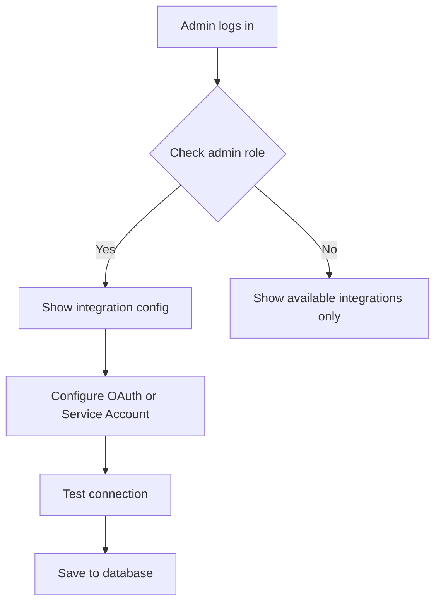
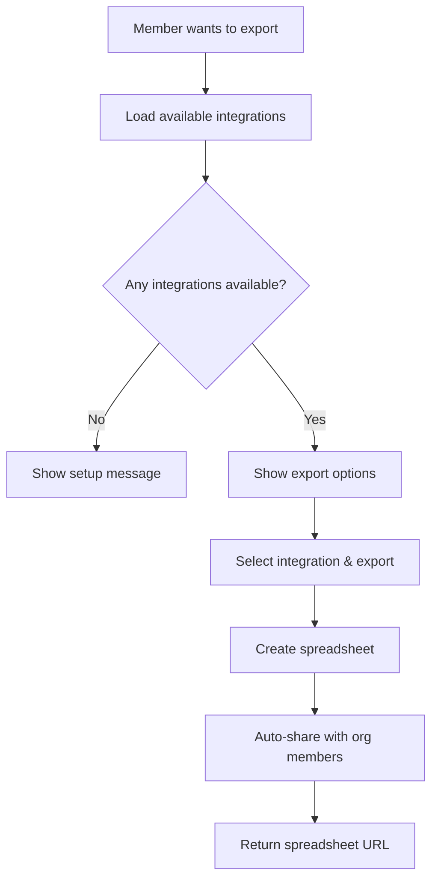

# Admin-Only Google Integration Model

This document explains how the Google integration works with admin-only configuration and organization-wide sharing.

## Overview

In this model, **only organization administrators** can configure Google integrations, but **all organization members** can use them to export data and create spreadsheets.

## How It Works

### 🔐 Admin Configuration
- **Who**: Organization administrators only
- **What**: Set up OAuth and Service Account integrations
- **Access**: Full configuration access through integrations page

### 👥 Member Usage  
- **Who**: All organization members
- **What**: Use admin-configured integrations to export data
- **Access**: Export functionality only, no configuration

## Authentication Methods

### 1. Admin OAuth Integration
**Setup**: Admin connects their personal Google account
```typescript
// Admin connects their Google account
const adminIntegration = {
  authMethod: 'oauth',
  userId: 'admin-user-id',
  email: 'admin@company.com', // Admin's personal Google account
  orgId: 'org-123'
}
```

**Benefits**:
- Quick setup for small teams
- Uses admin's existing Google account
- Files created are owned by admin but can be shared

**Usage**:
- When members export data, it creates files in admin's Google Drive
- Files are automatically shared with organization members
- Admin retains ultimate control over files

### 2. Service Account Integration
**Setup**: Admin configures organization-wide service account
```typescript
// Organization service account
const serviceAccountIntegration = {
  authMethod: 'service_account',
  userId: 'admin-who-configured-it', // For audit trail
  email: 'k-fin@project-123.iam.gserviceaccount.com',
  orgId: 'org-123'
}
```

**Benefits**:
- True organization ownership
- No dependency on individual admin accounts
- Better for production/enterprise usage
- Consistent access regardless of staff changes

**Usage**:
- Files created are owned by the service account
- Can be shared with organization members automatically
- More robust for long-term organizational use

## File Sharing Strategy

### Automatic Sharing Options

#### 1. Share with Individual Members
```typescript
// Share with all org members individually
const orgMembers = await getOrganizationMembers(orgId);
const memberEmails = orgMembers.map(m => m.email);

await googleAPIService.shareSpreadsheet(
  integration,
  spreadsheetId,
  memberEmails,
  'writer' // or 'reader'
);
```

#### 2. Share with Organization Domain (Google Workspace)
```typescript
// Share with entire company domain
await googleAPIService.shareSpreadsheetWithDomain(
  integration,
  spreadsheetId,
  'company.com',
  'reader'
);
```

#### 3. Create in Shared Folder
```typescript
// Create organization folder structure
const orgFolder = await googleAPIService.createSharedFolder(
  integration,
  'K-Fin Organization Data'
);

// Move exported files to shared folder
await googleAPIService.moveToFolder(
  integration,
  spreadsheetId,
  orgFolder.id
);
```

## Implementation Flow

### 1. Admin Setup


### 2. Member Usage


## Benefits of This Approach

### For Organizations
- **Centralized Control**: Admins control all Google integrations
- **Consistent Access**: All members use the same integration
- **Security**: No need for individual user Google authentications
- **Compliance**: Better audit trail and data governance

### For Members
- **Simple Usage**: No setup required, just use existing integrations
- **No Google Account Required**: Members don't need personal Google accounts
- **Automatic Sharing**: Exported files are automatically accessible to team

### For Admins
- **Full Control**: Manage all Google resources from one place
- **Easy Maintenance**: Update credentials in one place
- **Better Organization**: All exported data goes to controlled locations

## Security Considerations

### Admin Responsibilities
- Keep Google credentials secure
- Regularly review file permissions
- Monitor usage through audit logs
- Rotate service account keys periodically

### Access Control
- Only admins can configure integrations
- Members can only use existing integrations
- All exports are logged for audit purposes
- File sharing is controlled and automatic

## Example Usage Scenarios

### Scenario 1: Small Team with Admin OAuth
1. **Admin**: Connects personal Google account
2. **Members**: Export financial reports
3. **Result**: Reports created in admin's Drive, shared with team
4. **Benefit**: Quick setup, personal ownership with team access

### Scenario 2: Enterprise with Service Account
1. **Admin**: Sets up service account with organization Google Workspace
2. **Members**: Export various reports and analyses
3. **Result**: All files owned by organization, stored in shared folders
4. **Benefit**: Professional setup, organization ownership, scalable

### Scenario 3: Mixed Approach
1. **Admin OAuth**: For quick personal exports and testing
2. **Service Account**: For official reports and long-term storage
3. **Members**: Choose appropriate integration based on use case
4. **Benefit**: Flexibility for different types of exports

## Migration Path

If you currently have individual user OAuth:

1. **Phase 1**: Set up admin-only integrations alongside existing
2. **Phase 2**: Migrate users to use admin integrations
3. **Phase 3**: Deprecate individual user OAuth
4. **Phase 4**: Admin-only model fully implemented

This approach provides better organizational control while maintaining ease of use for all team members. 